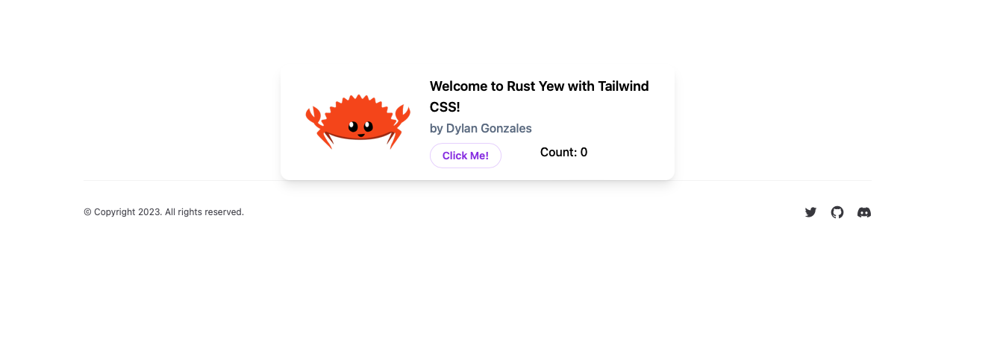

# Rust + Yew + Tailwind CSS

[](https://www.rust-lang.org) [](https://yew.rs) [](https://nodejs.org/en/) [](https://tailwindcss.com) [](https://pre-commit.com) [](https://docs.github.com/en/actions)

This repository contains a Rust (Yew) frontend that leverages Tailwind CSS for theming and styling. Additionally, this repository implements state management using the [bounce](https://bounce-rs.org) library - similar to [zustand](https://github.com/pmndrs/zustand) as it relates to Redux state management in ReactJS.



## Table of Contents

- [Getting Started](#getting-started)
  - [Prerequisites](#prerequisites)
  - [Local Development Guide](#local-development-guide)
- [Need Support?](#need-support)
- [Reporting Security Vulnerabilities and Security Bugs](#reporting-security-vulnerabilities-and-security-bugs)
- [Contributing](#contributing)

## Getting Started

This section provides supporting steps and documentation for developing locally.

### Prerequisites

Before jumping into the code, there are a few prerequisites.

1. Local development should be done from a UNIX-based machine - use Linux, MacOS, or WSL2 if you're on a Windows machine.

2. GitHub access should be managed through an SSH key in your UNIX environment. If you're unfamiliar with this process [start here](https://docs.github.com/en/authentication/connecting-to-github-with-ssh).

3. [pre-commit](https://pre-commit.com/) should be installed globally on your machine for linting and validating your code prior to pushing up to GitHub.

4. [Rust](https://www.rust-lang.org/tools/install) should be installed globally on your machine for compiling and running code.

5. Optionally, the [Rust-Analyzer](https://marketplace.visualstudio.com/items?itemName=rust-lang.rust-analyzer) extension can be installed in VS Code for a better development experience.

6. [Node Version Manager](https://github.com/nvm-sh/nvm) should be installed on your machine for managing node versions for current and future maintenance of UI packages. This project is currently using v18.13.0.

   ```sh
   source ~/.nvm/nvm.sh  # activate nvm once installed

   nvm install v18.13.0  # install node

   nvm use v18.13.0  # use node
   ```

### Local Development Guide

1. Clone the repository (if this is your first time).

   ```sh
   git clone git@github.com:dgonzo27/rust-yew-tailwind.git
   ```

2. Navigate into the repository directory.

   ```sh
   cd rust-yew-tailwind
   ```

3. Ensure pre-commit is enabled for this repository.

   ```sh
   pre-commit install
   ```

4. Enable node version manager.

   ```sh
   source ~/.nvm/nvm.sh  # activate nvm

   nvm use v18.13.0  # use node
   ```

5. Setup the project.

   ```sh
   cd client

   npm run setup
   ```

6. Run the project.

   ```sh
   npm run dev
   ```

7. Visit [http://localhost:8080](http://localhost:8080).

## Need Support?

File an issue via [GitHub Issues](https://github.com/dgonzo27/rust-yew-tailwind/issues).

## Reporting Security Vulnerabilities and Security Bugs

Security vulnerabilities and bugs should be reported privately, via email, to the maintainers of this repository. Please contact [Dylan Gonzales](mailto:dylangonzales247@gmail.com). For more information, visit the [security guidelines](./SECURITY.md).

## Contributing

Before contributing to this repository, please review the [code of conduct](./CODE_OF_CONDUCT.md).

Contributions and suggestions are welcomed. However, there is a level of responsibility placed on the contributor to follow best-practices, provide thorough testing, follow the branching strategy, use the pull request template, and maintain a positive and coachable attitude when receiving feedback or questions on your code. For more details on these responsibilities, please visit the [contributing guide](./CONTRIBUTING.md).

When contributing, you are granting the maintainers of this repository the rights to use your contribution(s).
